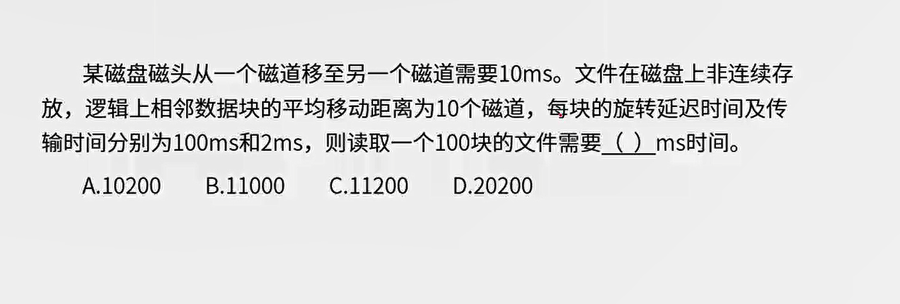

# 计算机结构


## CPU 组成

不常考，了解

**控制器**

控制器是分析和执行指令的部件，也是统一指挥并控制计算机各部件协调工作的中心部件，所依据的是机器指令。控制器的组成包含如下。

1.  **程序计数器 PC**：存储下一条要执行指令的地址 （重点）
2.  指令寄存器 IR：存储即将执行的指令
3.  指令译码器 ID：对指令中的操作码字段进行分析解释
4.  时序部件：提供时序控制信号

**运算器**

运算器也称为算术逻辑单元（ArithmeticandLogicUnit， ALU），其主要功能是在控制器的控制下完成各种算术运算和逻辑运算。运算器的组成包含如下：

1.  算术逻辑单元 ALU：数据的算术运算和逻辑运算；
2.   累加寄存器 AC：通用寄存器，为 ALU 提供一个工作区，用在暂存数据；
3.   数据缓冲寄存器 DR：写内存时，暂存指令或数据；
4.   状态条件寄存器 PSW：存状态标志与控制标志（争议点：也有将其归为控制器的）。

**主存储器**

主存储器也称为内存储器（通常简称为“内存”或“主存”）。存储现 场
  操作的信息与中间结果，包括机器指令和数据。

**辅助存储器**

辅助存储器也称为外存储器，通常简称为外存或辅存。存储需要长期保存的各种信息。

 **输入\输出设备**

## 冯诺依曼结构

也称为普林斯顿结构，将指令存储器和数据存储器放在一起。指令和数据都通过相同的数据总线传输。

## 哈弗结构

程序和数据存储在不同的存储空间。一般用于嵌入式。

1. 每个存储器独立编址、独立访问。

2. 可以并行读取，有较高的数据吞吐率。

3.  有4 条总线

## 嵌入式芯片

1.  DSP 数字信号处理器 大脑
2.  SoC system on Chip  完整的微小型系统
3. MPU 微处理器 缩小版大脑
4.  MCU 单片机 缩小版人


## 层次化存储结构

cpu -> cache -> 内存 -> 外存

使用层次化存储结构是为了解决存储的容量、价格和速度之间的矛盾


## 主存编址

bit 比特位

字长(有多少比特位，8位特殊称为字节)

8bit 字节 1B=8bit

### 存储单元

存储单元个数 = 最大地址 - 最小地址 + 1 =  最大地址+ 1 - 最小地址 (凑整)

### 编址内容

按字编址：存储体的存储单元是字存储单元，即最小寻址单位是一个字

按字节编址：存储体的存储单元是字节存储单元，即最小寻址单位是一个字节


## 磁盘管理

[硬盘基本知识](https://www.jianshu.com/p/ffc2056766b6)

下图显示的是一个盘面，盘面中一圈圈灰色同心圆为一条条磁道，从圆心向外画直线，可以将磁道划分为若干个弧段，每个磁道上一个弧段被称之为一个扇区（图践绿色部分）


寻道时间是只磁头移动到磁道所需的时间。

等待时间为等待读写的扇区转到磁头下方所用的时间。

```
 存取时间 = 寻道时间  + 等待时间
 # 就是先移动到指定的磁道再移动到指定的扇区
```

### 磁盘调度

FCFS (First-Come, First Served)：平均寻道长度= （当前 - 下一个）的绝对值的总和

最短寻道时间（SHortest Seek Time First）：距离优先，即找出与当前磁道号最近的磁道号

  

## 流水线

流水线技术把一个任务分解为若干顺序执行的子任务，不同的子任务由不同的执行机构负责执行，而这些机构可以同时并行工作。在任一时刻，任一任务只占用其中一个执行机构，这样就可以实现多个任务的重叠执行，以提高工作效率。

###  流水线周期

流水线应用过程中，会将需要处理的工作分为 N 个阶段，最耗时的那一段所消耗的时间为**流水线周期**。如：使用流水线技术执行 100 条指令，每条指令取指 2ms，分析 4ms，执行 1ms，则流水线周期为 4ms。

### 计算流水线执行时间

T: 流水线周期

N: 任务的阶段数量

n: 代表需要处理的任务数量。

```
# 理论公式
流水线执行时间 = 第 1 条指令的执行时间 +（n- 1） * T

# 实际公式
流水线执行时间 = NT +（n- 1） * T

```

考试时 80%以上的概率采用理论公式计算，所以考试时需要以理论公式计算，若计算的结果无正确选项才考虑采用实际公式计算。


### 流水线的吞吐率

流水线的吞吐率（Though Put rate， TP）是指在单位时间内流水线所完成的任务数量或输出的结果数量。有些文献也称为平均吞吐率、实际吞吐率。计算流水线吞吐率的最基本的公式如下：$\frac{指令条数}{流水线执行时间} $

```
流水线吞吐率 = 指令条数  / 流水线执行时间

最大吞吐率 TPmax = lim(n/(k + n - 1t)) = 1/t, 即流水线周期的导数
```


### 流水线的加速比

完成同样一批任务，不使用流水线所用的时间与使用流水线所用的时间之比称为流水线的加速比（speedup ratio）。

如果不使用流水线，即顺序执行所用的时间为 T0 ，使用流水线的执行时间为 Tk ，则计算流水线加速比的基本公式如下：$\frac{T0}{TK}$


## 校验码

### 奇偶校验


### 循环冗余校验 CRC

 在信息尾部加上校验码。CRC 也不能纠错。

具体操作过程为：

1. 计算被除数，被除数等于多项式从最高次项到最低次项的系数集合，比如 G(x) = x^4 + x + 1 = X^4 + 0X^3 + 0X^2 + X + X^0 = 1 0 0 1 1
2. 计算余数位，也就是补零，补 0 的个数等于多项式最高次幂，也就是被除数位数 - 1
3. 将原始报文补上余数位和被除数进行模2除  
4. 编码结果 = 原始报文 + 最后 得到的余数(不足余数位要在前面补 0)，比如报文10111，余数位有4位，余数位11，结果为101110011

> 补充知识 [二进制加减乘除](https://www.jianshu.com/p/560aba49c9a4)
>
> 加法：逢二进一，低位开始
>
> 减法：借一有二，低位开始
>
> 乘法：同10进制，低位开始
>
> 除法：除数从高位开始和被除数比大小，小就记为0，大就即为1并且和被除数做减法

二进制除法计算过程如下：


  ### 模2除

模2除是只在做除法运算的过程中不计其进位（接位）的除法，即异或运算（同为假 ，异为真）。 

### 海明校验

 2^r >= m + r + 1

计算 r 的值

## 计算机结构 QA

Q： 计算机执行程序时，在一个指令周期的过程中，为了能够从内存中读指令操作码，首先是将（ ）的内功送到地址总线上。

A： 程序计数器 PC

### 主存编址 QA

Q: 内存按字节编址，利用 8K * 4bit 的出错芯片构成 84000H 到 8FFFFH的内存，共需要多少片?

```
8FFFFH + 1 = 90000H

 90000H 
-84000H
=0C000H
= 12 * 16^3 * 8 bit

总容量 = 存储单元个数 * 编址内容
所以需要的片数 =  12 * 16^3 * 8 / (8 * 2^10 * 4)  = 12 * 8 * (2^4)^3 / (8 * 4 * 2^10)  = 12
```


### 磁盘管理 QA

**存取时间**

 


100* (10 * 10 + 100 + 2)


**磁盘优化分布存储**


 

磁盘扇区示意图


在没有优化前，磁头先读 R0, 用时为 33/11 + 3 = 6ms。接下来读 R1，由于在读取 R0 数据的时候磁头并不会停下等，所以 6 ms 过去之后，磁头到了 R1 扇区的结束位置，所以 R1 的旋转等到时间为磁头转过 10 个扇区 的时间，

因此处理 R1 需要的时间为 10 * 3 + 3 + 3 = 36 ms。以此类推，后面的 R2 到 R10 用时都一样。所以总的时间为：

36 * 10 + 6 = 366

上面耗时最多的步骤在旋转等待上，优化之后旋转等待时间就没有了，总用时为 11 * (3 + 3) = 66 


**综合题**


单缓冲区在处理过程中其他进程不能使用缓冲区。

单缓冲处理过程

```
15 + 5 + 1
  		15 + 5 + 1
  				15 + 5 + 1
  						...
time = (15 + 5) * 9 + （15 + 5 + 1）
```

双缓存区处理过程

中间的 5 + 1 在时空上是可以并行的

```
15 + 5 + 1
	15 + 5 + 1
		15 + 5 + 1
			...
			
time = 15 * 9  + (10 +5 + 1)
```


### 流水线 QA

Q：


A： 吞吐率为流水线周期的导数 = 1/3，加速比计算如下：

```
不使用流水线的执行时间 T0 = (2 + 1 + 3 + 1 + 2) * 10 = 90
使用流水线的执行时间 Tk = 2 + 1 + 3 + 1 + 2 + 3 * (10-1) = 36
所以加速比 = T0/Tk = 5/2
```


 
